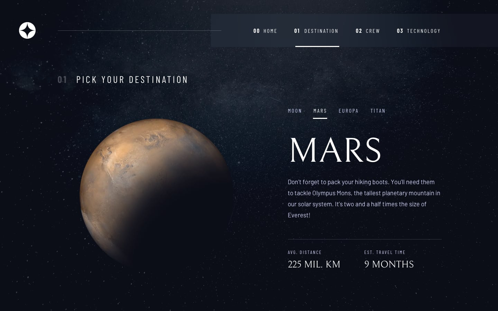
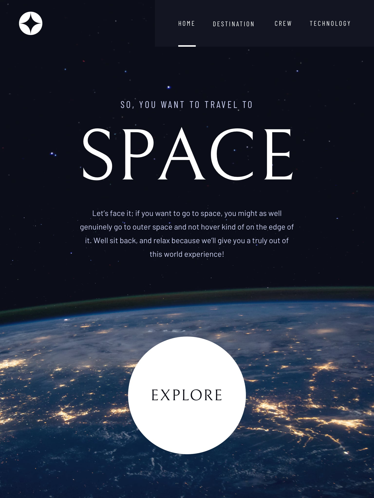

# Space tourism website solution [WIP]

This is a solution to the [Space tourism website challenge on Frontend Mentor](https://www.frontendmentor.io/challenges/space-tourism-multipage-website-gRWj1URZ3). Frontend Mentor challenges help you improve your coding skills by building realistic projects.

## Table of contents

- [The challenge](#the-challenge)
- [Screenshot](#screenshot)
- [Built with](#built-with)
- [Author](#author)

### The challenge

Users should be able to:

- View each page and be able to toggle between the tabs to see new information
- View the optimal layout for each of the website's pages depending on their device's screen size
- See hover states for all interactive elements on the page

### Screenshot

### Built with

- React + Nextjs
- Typescript
- Tailwind CSS
- Mobile-first workflow

## Author

- Frontend Mentor - [@Richard-S16](https://www.frontendmentor.io/profile/Richard-S16)
- LinkedIn - [Richard Schmidt](https://www.linkedin.com/in/richard-schmidt16/)
